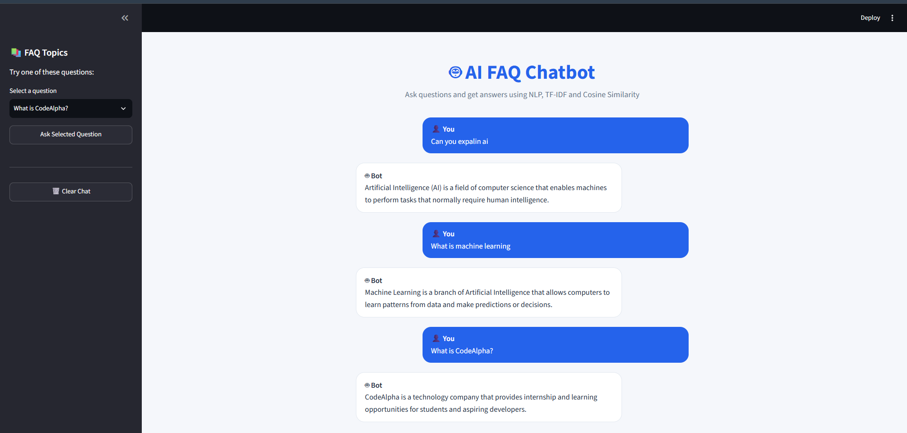

# 🤖 FAQ Chatbot

An intelligent FAQ chatbot built with **Python, Streamlit, and scikit-learn**. The application uses **TF-IDF vectorization** and **cosine similarity** to identify the most relevant answer to a user's question from a predefined FAQ knowledge base.

---

## 📌 Project Overview

The **FAQ Chatbot** is an AI-based question-answering application developed as part of the **CodeAlpha Artificial Intelligence Internship**.

Users can either select a frequently asked question from the provided list or enter their own question. The chatbot analyzes the question and finds the most similar question in its knowledge base before returning the corresponding answer.

This project demonstrates a basic **Natural Language Processing (NLP)** approach to building an interactive chatbot.

---

## ✨ Features

* 🤖 Interactive FAQ chatbot
* 💬 Custom user questions
* 📋 Predefined FAQ question selection
* 🧠 TF-IDF text vectorization
* 🔍 Cosine similarity-based question matching
* ⚡ Fast response generation
* 🛡️ Fallback response for unsupported questions
* 🌐 Interactive Streamlit web interface
* 📱 Simple and user-friendly design

---

## 🛠️ Technologies Used

| Technology            | Purpose                                |
| --------------------- | -------------------------------------- |
| **Python**            | Core programming language              |
| **Streamlit**         | Web application interface              |
| **scikit-learn**      | Machine learning and NLP functionality |
| **TF-IDF**            | Converts text into numerical vectors   |
| **Cosine Similarity** | Measures similarity between questions  |

---

## 🧠 How the Chatbot Works

The chatbot follows these steps:

1. A collection of frequently asked questions and answers is stored in the application.
2. The FAQ questions are converted into numerical vectors using **TF-IDF**.
3. The user enters a question.
4. The user's question is also converted into a TF-IDF vector.
5. **Cosine similarity** compares the user's question with all FAQ questions.
6. The chatbot identifies the question with the highest similarity score.
7. The corresponding answer is displayed to the user.
8. If the similarity score is too low, the chatbot provides a fallback response.

### Basic Workflow

```text
User Question
      ↓
Text Processing
      ↓
TF-IDF Vectorization
      ↓
Cosine Similarity
      ↓
Find Best Matching FAQ
      ↓
Return Answer
```

---

## 📚 FAQ Knowledge Base

The chatbot currently contains questions related to:

* CodeAlpha
* Artificial Intelligence
* Machine Learning
* Python
* Streamlit
* Chatbots
* APIs
* Natural Language Processing
* Deep Learning
* Learning Artificial Intelligence
* Data Science
* Computer Vision

---

## 🚀 Installation and Setup

### 1. Clone the Repository

```bash
git clone https://github.com/maimoonaamjid/CodeAlpha_FAQ_Chatbot.git
```

### 2. Navigate to the Project Directory

```bash
cd CodeAlpha_FAQ_Chatbot
```

### 3. Create a Virtual Environment

```bash
python -m venv venv
```

### 4. Activate the Virtual Environment

For Windows PowerShell:

```powershell
.\venv\Scripts\Activate.ps1
```

### 5. Install Dependencies

```bash
pip install -r requirements.txt
```

### 6. Run the Application

```bash
python -m streamlit run app.py
```

The application will open in your web browser.

---

## 💻 Usage

After launching the application:

1. Open the FAQ Chatbot in your browser.
2. Select a question from the FAQ dropdown, **or**
3. Enter your own question in the text box.
4. Click **Get Answer**.
5. The chatbot will display the most relevant response.

### Example

**User Question:**

```text
What is artificial intelligence?
```

**Chatbot Response:**

```text
Artificial Intelligence (AI) is a field of computer science
that enables machines to perform tasks that normally require
human intelligence.
```

---

## 📂 Project Structure

```text
CodeAlpha_FAQ_Chatbot/
│
├── app.py                 # Main Streamlit application
├── requirements.txt       # Python dependencies
├── README.md              # Project documentation
├── .gitignore             # Files ignored by Git
└── venv/                  # Virtual environment
```

> The `venv` directory is excluded from GitHub using `.gitignore`.

---

## 🎯 Project Objectives

The main objectives of this project are:

* Understand the fundamentals of FAQ chatbot development.
* Apply basic Natural Language Processing techniques.
* Learn how TF-IDF works with text data.
* Use cosine similarity for text matching.
* Build an interactive AI application using Streamlit.
* Gain practical experience with Python and scikit-learn.
* Practice version control and GitHub project management.

---

## 🔮 Future Improvements

Possible future enhancements include:

* Adding a larger FAQ knowledge base.
* Supporting multiple languages.
* Adding conversation history.
* Using more advanced NLP techniques.
* Integrating a machine learning or transformer-based model.
* Adding voice input and text-to-speech functionality.
* Connecting the chatbot to an external database.
* Improving the user interface with custom styling.

---

## 📸 Application Preview

### FAQ Chatbot Interface



---

## 🔗 GitHub Repository

**Repository:**
https://github.com/maimoonaamjid/CodeAlpha_FAQ_Chatbot

---

## 👩‍💻 Internship Project

**Program:** CodeAlpha Artificial Intelligence Internship

**Project:** FAQ Chatbot

**Technologies:** Python • Streamlit • scikit-learn • NLP

---

## 📄 License

This project was developed for educational and internship purposes.
